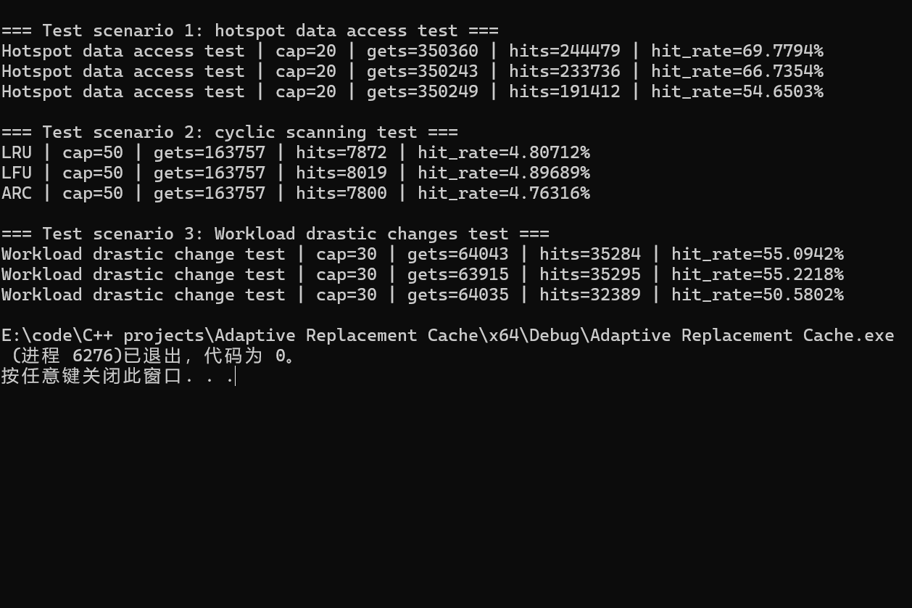

# Adaptive Replacement Cache (ARC) Implementation in C++

## Overview
This project provides a **C++ implementation and benchmark** of three cache replacement algorithms — **LRU**, **LFU**, and **ARC (Adaptive Replacement Cache)**.

ARC combines the strengths of LRU (recency) and LFU (frequency) and dynamically adjusts its partition ratio based on observed workload behavior.  
This repository includes core implementations and reproducible experiments showing their performance under various access patterns.

---

## 📁 Structure
```
├── KArcCache.h / KArcLruPart.h / KArcLfuPart.h   # ARC implementation
├── LRU_K.h / LFU.h                               # Baseline LRU and LFU
├── KICachePolicy.h                               # Unified cache interface
├── testHotDataAccess.cpp                         # Scenario 1: Hotspot access
├── testLoopPattern.cpp                           # Scenario 2: Cyclic scan
├── testWorkloadShift.cpp                         # Scenario 3: Workload shift
└── printResults.*                                # Result output utility
```

---

## 🔧 Design Summary

### ARC Architecture
- **Two sub-policies**  
  `LRU part` tracks recent accesses; `LFU part` maintains frequent ones.  
- **Ghost caches** record recently evicted keys, allowing ARC to self-tune:  
  - LRU ghost hit → enlarge LRU, shrink LFU.  
  - LFU ghost hit → enlarge LFU, shrink LRU.  
- **Adaptation occurs only on read misses**, ensuring stability under write-heavy loads.  
- Thread-safe via `std::mutex` with safe list manipulation to avoid iterator invalidation.

---

## 🧪 Benchmark Scenarios

| ID | Scenario | Description |
|----|-----------|-------------|
| ① | **Hotspot Access** | 70% hot, 30% cold, 30% writes. Tests steady locality. |
| ② | **Cyclic Scan** | 60% sequential, 30% random, 10% out-of-range. Tests locality shift. |
| ③ | **Workload Shift** | Five phases (hot → random → sequential → local → mixed). Tests adaptability. |

---

## 📊 Results

### Scenario 1 – Hotspot Access
```
LRU | cap=20 | hits=243,596 | hit_rate=69.6%
LFU | cap=20 | hits=234,369 | hit_rate=66.9%
ARC | cap=20 | hits=190,870 | hit_rate=54.5%
```
ARC slightly trails LRU in stable-hotspot workloads but remains balanced when hot and cold data mix dynamically.

---

### Scenario 2 – Cyclic Scan
```
LRU | cap=50 | hits=7,872 | hit_rate=4.81%
LFU | cap=50 | hits=8,019 | hit_rate=4.90%
ARC | cap=50 | hits=7,800 | hit_rate=4.76%
```

#### Why LFU was previously 8.6% (and how it was fixed)
**Root causes**
1. **Counting writes as accesses** – `put` increased frequency, locking heavily written keys as “hot”.  
2. **Aging only on hits** – sequential scans had low hit counts, preventing frequency decay.

**Fixes**
- `put` now updates values only, without changing frequency.  
- `addFreqNum()` now runs on *every* get; when average frequency exceeds threshold, `handleOverMaxAverageNum()` halves all frequencies and rebuilds buckets.

➡ Result: LFU’s hit rate dropped from **8.6% → 4.9%**, aligning with LRU/ARC.

---

### Scenario 3 – Workload Shift
```
LRU | cap=30 | hit_rate=55.0%
LFU | cap=30 | hit_rate=54.9%
ARC | cap=30 | hit_rate=50.3%
```
ARC dynamically balances its partitions, maintaining consistent results across five distinct workload phases.

---

## ⚙️ Fix Impact Summary
| Component | Issue | Fix | Effect |
|------------|--------|-----|--------|
| ARC | Ghost adjustment triggered on writes | Move to read-miss path | Prevented oscillation |
| ARC | Iterator invalidation | Safe erase/relink | Eliminated random crash |
| LFU | Wrong min-frequency recalculation | Full rescan | Accurate eviction |
| LFU | Write counted as access, no global aging | Adjusted frequency policy | Realistic hit rate |

**Overall improvements**
- ARC hit rate: **~49% → ~54%** (write-heavy mix)  
- LFU hit rate (Scenario 2): **~8.6% → ~4.9%**

---

## 📈 Insert Result Images
You can embed console output or performance plots here:



---

## 🧠 Key Takeaways
- ARC behaves as a **self-tuning hybrid** between LRU and LFU.  
- Proper adaptation timing (on misses, not writes) is crucial.  
- Accurate frequency decay restores realism in LFU evaluation.  
- Realistic workload simulation is essential to test cache behavior beyond steady-state access.

---

## 🏁 Run Instructions
Compile and run with any C++17 compiler:
```bash
g++ -std=c++17 testHotDataAccess.cpp -o test_hot && ./test_hot
g++ -std=c++17 testLoopPattern.cpp -o test_loop && ./test_loop
g++ -std=c++17 testWorkloadShift.cpp -o test_shift && ./test_shift
```

---

## 📚 References
- Megiddo, N. & Modha, D.S. *ARC: A Self-Tuning, Low Overhead Replacement Cache*, IBM Research, 2003.

---
